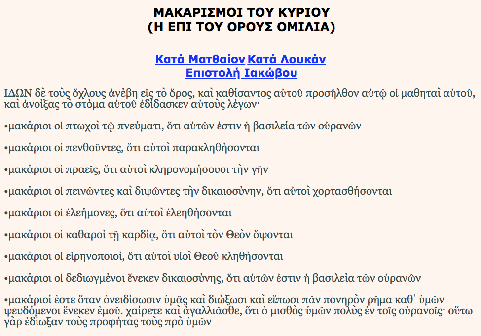

Η εφαρμογή αυτή περιέχει τους Μακαρισμούς του Ιησού Χριστού

Οι Μακαρισμοί του Κυρίου είναι οκτώ ευλογίες, το κείμενο των οποίων παρέδωσε προφορικά ο Ιησούς Χριστός στην Επί του Όρους Ομιλία (Κατά Ματθαίον Ευαγγέλιον).

Ο κάθε μακαρισμός αποτελεί μια διακήρυξη σαν παροιμία

<b>Google Play</b>: https://play.google.com/store/apps/details?id=appinventor.ai_fsiamp.MAKARISMOITOUKIRIOU

